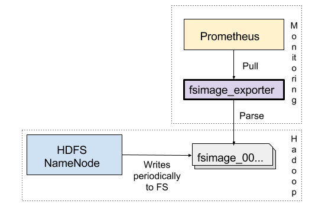

Prometheus Hadoop HDFS FSImage Exporter
=======

[][license]
[][maven_repo_search]
[][docker_hub]
[](https://github.com/marcelmay/hadoop-hdfs-fsimage-exporter/actions/workflows/ci.yml)
[](https://github.com/marcelmay/hadoop-hdfs-fsimage-exporter/actions/workflows/codeql.yml)

Exports Hadoop HDFS statistics to [Prometheus monitoring](https://prometheus.io/) including
* total / per user / per group / per configured directory path / per set of paths 
    * number of directories
    * number of files
    * file size and optionally size distribution
    * number of blocks
    * file replication (overall / per user summary)
    
The exporter parses the FSImage using the [Hadoop FSImage Analysis library](https://github.com/marcelmay/hfsa).
This approach has the advantage of
* being fast (2.6 GB FSImage ~ 50s)
* adding no heavy additional load to HDFS NameNode (no NameNode queries, you can run it on second NameNode)

The disadvantage is
* no real time update, only when NameNode writes FSImage (interval of hours, see
  [dfs.namenode.checkpoint.period](https://hadoop.apache.org/docs/current/hadoop-project-dist/hadoop-hdfs/hdfs-default.xml#dfs.namenode.checkpoint.period)).  
  This should be sufficient for most cases (long-term trend, detecting HDFS small file abuses, user and group stats)
* parsing takes 2x-3x FSImage size in heap space



The exporter parses fsimage data in background thread which checks every 60s for fsimage changes.
This avoids blocking and long-running Prometheus scrapes and potentially stale metrics.

## Grafana dashboards

* [Hadoop HDFS FSImage by kaszpir](https://grafana.com/grafana/dashboards/12236)

## Requirements
For building:
* JDK 8
* [Maven 3.9.x](http://maven.apache.org)
* Docker (only required if building docker image)

For running:
* JRE 8+ for running (JRE 17+ LTS recommended)
* Access to Hadoop FSImage file
* Docker (only required if building docker image)

## Downloading

Available on [](http://search.maven.org/#search%7Cga%7C1%7Cg%3A%22de.m3y.prometheus.exporter.fsimage%22%20AND%20a%3A%22fsimage-exporter%22) and as docker image on [Docker Hub][docker_hub]

## Building

```mvn clean install```

You can test the exporter using [run_example.sh](run_example.sh) after building.

For building including docker image, run:

```mvn clean install -Pdocker```

You can run the docker image via maven, too:

```mvn clean install docker:run -Pdocker```

Or directly using docker command line

```
docker run -i -t -p 9709:9709 -v $PWD/src/test/resources:/fsimage-location \
           -e "JAVA_OPTS=-server -XX:+UseG1GC -Xmx1024m" \
           marcelmay/hadoop-hdfs-fsimage-exporter
```

When running the docker image via Maven, docker will mount the projects' src/test/resources directory (with test fsimage) and expose the exporter on http://0.0.0.0:9709/ .


## Installation and configuration

* Install the JAR on a system where the FSImage is locally available (e.g. name node server).

* Configure the exporter     
  Create a yml file (see [example.yml](example.yml)):
  ```
  # Path where HDFS NameNode stores the fsimage files
  # See https://hadoop.apache.org/docs/r2.7.3/hadoop-project-dist/hadoop-hdfs/hdfs-default.xml#dfs.namenode.name.dir
  fsImagePath : 'src/test/resources'
  
  # Skip file size distribution for group based stats
  skipFileDistributionForGroupStats : true
  
  # Skip file size distribution for user based stats
  # Enable for figuring out who has too many small files.
  skipFileDistributionForUserStats : false
  
  # Compute per path stats
  # Supports regex matching per path part
  paths:
    - '/tmp'
    - '/datalak.?/a.*'
    - '/hive_warehouse/.*/.*'
    - '/user/m.*'
    
  # Skip file size distribution for path based stats
  skipFileDistributionForPathStats : true
  
  # Path sets are grouped paths by an identifier.
  # The exporter computes for each identifier the stats.
  # Compared to simple "paths" above, this allows to specify several paths for one stat computation.
  pathSets:
    'userMmAndFooAndAsset1' : [
      '/datalake/asset3',
      '/user/mm',
      '/user/foo'
      '/user/b.*' # With regexp for path part
      ]
    'datalakeAsset1and2' : [
      '/datalake/asset1',
    '/datalake/asset2'
    ]
    
  # Skip file size distribution for path sets based stats
  skipFileDistributionForPathSetStats : true
  ```
  Note that the flag toggling file size distribution switches between [Summary](https://github.com/prometheus/client_java#summary) (few time series)
  and [Histogram](https://github.com/prometheus/client_java#histogram) (many time series)
 
* Run the exporter
  ```
    > java -jar target/fsimage-exporter.jar
    Usage: WebServer [-Dlog.level=[WARN|INFO|DEBUG]] <hostname> <port> <yml configuration file>
  ```
  Example JVM opts (-Xmx max heap depends on your fsimage size): 
  ```
  > java -Xmx1024m -dsa -server -XX:+UseG1GC \
         -jar target/fsimage-exporter-1.0-SNAPSHOT.jar \
         0.0.0.0 9709 example.yml
  ```
  Note: Make sure to size the heap correctly. As a heuristic, you can use 3 * fsimage size.

  Note: Previous versions up to 1.3 use the default port 7772 instead of 9709
  
* Test the exporter  
  Open http://\<hostname>:\<port>/metrics or http://\<hostname>:\<port>/ (for configuration overview)
   
* Add to prometheus
  ```
  - job_name: 'fsimage'
      scrape_interval: 180m # Depends on how often the name node writes a fsimage file.
      scrape_timeout:  200s # Depends on size
      static_configs:
        - targets: ['<hostname>:<port>']
          labels:
            ...
  ```
  Note:  
  For Grafana, you want to sample more often with a scrape interval of minutes.
  The exporter caches previously parsed FSImage, so it is a fast operation.


## Metrics

The metrics follow the naming and labelling pattern fsimage_[*AGG*_][*NAME*_]_[*METRIC TYPE SPECIFIC*] where
* *AGG* is the aggregation level
  * Empty aggregation for overall stats  
    Example for total number of files: `fsimage_fsize_count{}`
  * *user* for by user aggregations
    Example for number of files for a user: `fsimage_user_fsize_count{user_name="foo"}`
  * *group* for by group aggregations  
    Example for number of files for a group: `fsimage_group_fsize_count{group_name="nobody"}`
  * *path* for by configured path aggregations  
    Example for total size in path: `fsimage_path_fsize_sum{path="/datalake/asset2"}`
  * *path_set* for by configured path set aggregations  
    A path set aggregates for several configured paths and is identified by name  
    Example for total number of files for given path set `logs` : `fsimage_path_set_fsize_count{path_set="logs"}`

* *NAME* can be 
  * `fsize` for tracking file size and file number
  * `csize` for tracking consumed/erasure-encoded file size and file number
  * `replication` for tracking file replication
  * `blocks` for number of file data blocks
  * `dirs` for tracking number of files 
  * `links` for tracking number of symbolic links 
 
* *METRIC TYPE SPECIFIC* depends on metric type ([Counter, Gauge, Histogram, Summary ...](https://prometheus.io/docs/concepts/metric_types/)) 
 
### Details
* File size `fsize` and `csize`
  * Tracks number of files and file size
  * `csize` is the consumed/erasure-encoded size
  * Type: Depends on configuration flag `skipFileDistribution[ForUser|ForGroup|ForPath|ForPathSets]Stats`
    * [Summary](https://prometheus.io/docs/concepts/metric_types/#summary) : when flag is `false` (default)
    * [Histogram](https://prometheus.io/docs/concepts/metric_types/#histogram) : when flag is `true`  
      Note that you can also configure the buckets via `fileSizeDistributionBuckets`
  * fsimage_[*AGG*_]fsize_count : The total number of files
  * fsimage_[*AGG*_]fsize_sum : The total number of bytes 
  * fsimage_[*AGG*_]fsize_bucket{le="<upper inclusive bound>"} : The number of files in this bucket range
 
* Replication `replication`
  * Tracks file replication
  * Type: [Summary](https://prometheus.io/docs/concepts/metric_types/#summary)
  * fsimage_[*AGG*_]replication_count
  * fsimage_[*AGG*_]replication_sum
  
* File `blocks`
  * Tracks number of file blocks
  * Type: [Gauge](https://prometheus.io/docs/concepts/metric_types/#gauge)
  * fsimage_[*AGG*_]blocks

* Directory `dirs`
  * Tracks number of directories
  * Type: [Gauge](https://prometheus.io/docs/concepts/metric_types/#gauge)
  * fsimage_[*AGG*_]dirs

* Directory `links`
  * Tracks number of filesystem links
  * Type: [Gauge](https://prometheus.io/docs/concepts/metric_types/#gauge)
  * fsimage_[*AGG*_]links

### Exporter internal metrics

| Metric                                                                              | Type    | Descriptions                                                                                                                                          |
|-------------------------------------------------------------------------------------|---------|-------------------------------------------------------------------------------------------------------------------------------------------------------|
| fsimage_exporter_build_info{appVersion, buildTime, buildScmVersion, buildScmBranch} | Info    | Build info                                                                                                                                            |
| fsimage_compute_stats_duration_seconds[_count,_sum]                                 | Summary | Time for computing stats for a loaded/parsed FSImage (after parsing)                                                                                  |
| fsimage_load_duration_seconds[_count,_sum]                                          | Summary | Time for loading/parsing FSImage                                                                                                                      |
| fsimage_load_file_size_bytes                                                        | Gauge   | Size of raw FSImage file parsed                                                                                                                       |
| fsimage_scrape_duration_seconds                                                     | Gauge   | Exporter scrape request duration (does not include fsimage load/parsing/stats-computation)                                                            |
| fsimage_scrape_errors_total                                                         | Count   | Count of failed scrapes                                                                                                                               |
| fsimage_scrape_requests_total                                                       | Count   | Total number of scrape requests received                                                                                                              |
| jvm_memory*                                                                         |         | Exporter JVM memory settings, see [MemoryPoolsExports](https://prometheus.github.io/client_java/io/prometheus/client/hotspot/MemoryPoolsExports.html) |

## Example output

### Example home output


### Example metrics
Here's the example output for the [test fsimage](src/test/resources/fsimage_0001), using [example.yml](example.yml) configuration:

```
# HELP fsimage_exporter_build_info Hadoop FSImage exporter build info
# TYPE fsimage_exporter_build_info gauge
fsimage_exporter_build_info{appVersion="1.4.11-SNAPSHOT",buildTime="2025-02-17/18:04",buildScmVersion="d643236608f4508d401e663a71e3a8fc5a7e53c3",buildScmBranch="master",} 1.0
# HELP fsimage_dirs Number of directories.
# TYPE fsimage_dirs gauge
fsimage_dirs 14.0
# HELP fsimage_blocks Number of blocks.
# TYPE fsimage_blocks gauge
fsimage_blocks 17.0
# HELP fsimage_links Number of sym links.
# TYPE fsimage_links gauge
fsimage_links 0.0
# HELP fsimage_user_dirs Number of directories.
# TYPE fsimage_user_dirs gauge
fsimage_user_dirs{user_name="root",} 0.0
fsimage_user_dirs{user_name="foo",} 0.0
fsimage_user_dirs{user_name="mm",} 14.0
# HELP fsimage_user_blocks Number of blocks.
# TYPE fsimage_user_blocks gauge
fsimage_user_blocks{user_name="root",} 1.0
fsimage_user_blocks{user_name="foo",} 2.0
fsimage_user_blocks{user_name="mm",} 14.0
# HELP fsimage_user_links Number of sym links.
# TYPE fsimage_user_links gauge
fsimage_user_links{user_name="root",} 0.0
fsimage_user_links{user_name="foo",} 0.0
fsimage_user_links{user_name="mm",} 0.0
# HELP fsimage_group_dirs Number of directories.
# TYPE fsimage_group_dirs gauge
fsimage_group_dirs{group_name="root",} 0.0
fsimage_group_dirs{group_name="supergroup",} 14.0
fsimage_group_dirs{group_name="nobody",} 0.0
# HELP fsimage_group_blocks Number of blocks.
# TYPE fsimage_group_blocks gauge
fsimage_group_blocks{group_name="root",} 1.0
fsimage_group_blocks{group_name="supergroup",} 13.0
fsimage_group_blocks{group_name="nobody",} 3.0
# HELP fsimage_group_links Number of sym links.
# TYPE fsimage_group_links gauge
fsimage_group_links{group_name="root",} 0.0
fsimage_group_links{group_name="supergroup",} 0.0
fsimage_group_links{group_name="nobody",} 0.0
# HELP fsimage_path_dirs Number of directories.
# TYPE fsimage_path_dirs gauge
fsimage_path_dirs{path="/datalake/asset2",} 0.0
fsimage_path_dirs{path="/datalake/asset3",} 2.0
fsimage_path_dirs{path="/user/mm",} 0.0
fsimage_path_dirs{path="/datalake/asset1",} 0.0
# HELP fsimage_path_blocks Number of blocks.
# TYPE fsimage_path_blocks gauge
fsimage_path_blocks{path="/datalake/asset2",} 2.0
fsimage_path_blocks{path="/datalake/asset3",} 3.0
fsimage_path_blocks{path="/user/mm",} 0.0
fsimage_path_blocks{path="/datalake/asset1",} 0.0
# HELP fsimage_path_links Number of sym links.
# TYPE fsimage_path_links gauge
fsimage_path_links{path="/datalake/asset2",} 0.0
fsimage_path_links{path="/datalake/asset3",} 0.0
fsimage_path_links{path="/user/mm",} 0.0
fsimage_path_links{path="/datalake/asset1",} 0.0
# HELP fsimage_path_set_dirs Number of directories.
# TYPE fsimage_path_set_dirs gauge
fsimage_path_set_dirs{path_set="userMmAndFooAndAsset1",} 2.0
fsimage_path_set_dirs{path_set="datalakeAsset1and2",} 0.0
# HELP fsimage_path_set_blocks Number of blocks.
# TYPE fsimage_path_set_blocks gauge
fsimage_path_set_blocks{path_set="userMmAndFooAndAsset1",} 3.0
fsimage_path_set_blocks{path_set="datalakeAsset1and2",} 2.0
# HELP fsimage_path_set_links Number of sym links.
# TYPE fsimage_path_set_links gauge
fsimage_path_set_links{path_set="userMmAndFooAndAsset1",} 0.0
fsimage_path_set_links{path_set="datalakeAsset1and2",} 0.0
# HELP fsimage_fsize Overall file size distribution
# TYPE fsimage_fsize histogram
fsimage_fsize_bucket{le="0.0",} 0.0
fsimage_fsize_bucket{le="1048576.0",} 4.0
fsimage_fsize_bucket{le="3.3554432E7",} 13.0
fsimage_fsize_bucket{le="6.7108864E7",} 14.0
fsimage_fsize_bucket{le="1.34217728E8",} 15.0
fsimage_fsize_bucket{le="1.073741824E9",} 16.0
fsimage_fsize_bucket{le="1.073741824E10",} 16.0
fsimage_fsize_bucket{le="+Inf",} 16.0
fsimage_fsize_count 16.0
fsimage_fsize_sum 3.56409344E8
# HELP fsimage_csize Overall consumed file size distribution
# TYPE fsimage_csize histogram
fsimage_csize_bucket{le="0.0",} 0.0
fsimage_csize_bucket{le="1048576.0",} 4.0
fsimage_csize_bucket{le="3.3554432E7",} 13.0
fsimage_csize_bucket{le="6.7108864E7",} 14.0
fsimage_csize_bucket{le="1.34217728E8",} 14.0
fsimage_csize_bucket{le="1.073741824E9",} 16.0
fsimage_csize_bucket{le="1.073741824E10",} 16.0
fsimage_csize_bucket{le="+Inf",} 16.0
fsimage_csize_count 16.0
fsimage_csize_sum 5.40762112E8
# HELP fsimage_replication Overall file replication
# TYPE fsimage_replication summary
fsimage_replication_count 16.0
fsimage_replication_sum 22.0
# HELP fsimage_group_fsize Per group file size and file count
# TYPE fsimage_group_fsize summary
fsimage_group_fsize_count{group_name="root",} 1.0
fsimage_group_fsize_sum{group_name="root",} 1024.0
fsimage_group_fsize_count{group_name="supergroup",} 13.0
fsimage_group_fsize_sum{group_name="supergroup",} 1.6766464E8
fsimage_group_fsize_count{group_name="nobody",} 2.0
fsimage_group_fsize_sum{group_name="nobody",} 1.8874368E8
# HELP fsimage_group_csize Per group consumed file size and file count
# TYPE fsimage_group_csize summary
fsimage_group_csize_count{group_name="root",} 1.0
fsimage_group_csize_sum{group_name="root",} 1024.0
fsimage_group_csize_count{group_name="supergroup",} 13.0
fsimage_group_csize_sum{group_name="supergroup",} 3.52017408E8
fsimage_group_csize_count{group_name="nobody",} 2.0
fsimage_group_csize_sum{group_name="nobody",} 1.8874368E8
# HELP fsimage_user_fsize Per user file size distribution
# TYPE fsimage_user_fsize histogram
fsimage_user_fsize_bucket{user_name="root",le="0.0",} 0.0
fsimage_user_fsize_bucket{user_name="root",le="1048576.0",} 1.0
fsimage_user_fsize_bucket{user_name="root",le="3.3554432E7",} 1.0
fsimage_user_fsize_bucket{user_name="root",le="6.7108864E7",} 1.0
fsimage_user_fsize_bucket{user_name="root",le="1.34217728E8",} 1.0
fsimage_user_fsize_bucket{user_name="root",le="1.073741824E9",} 1.0
fsimage_user_fsize_bucket{user_name="root",le="1.073741824E10",} 1.0
fsimage_user_fsize_bucket{user_name="root",le="+Inf",} 1.0
fsimage_user_fsize_count{user_name="root",} 1.0
fsimage_user_fsize_sum{user_name="root",} 1024.0
fsimage_user_fsize_bucket{user_name="foo",le="0.0",} 0.0
fsimage_user_fsize_bucket{user_name="foo",le="1048576.0",} 0.0
fsimage_user_fsize_bucket{user_name="foo",le="3.3554432E7",} 0.0
fsimage_user_fsize_bucket{user_name="foo",le="6.7108864E7",} 0.0
fsimage_user_fsize_bucket{user_name="foo",le="1.34217728E8",} 0.0
fsimage_user_fsize_bucket{user_name="foo",le="1.073741824E9",} 1.0
fsimage_user_fsize_bucket{user_name="foo",le="1.073741824E10",} 1.0
fsimage_user_fsize_bucket{user_name="foo",le="+Inf",} 1.0
fsimage_user_fsize_count{user_name="foo",} 1.0
fsimage_user_fsize_sum{user_name="foo",} 1.6777216E8
fsimage_user_fsize_bucket{user_name="mm",le="0.0",} 0.0
fsimage_user_fsize_bucket{user_name="mm",le="1048576.0",} 3.0
fsimage_user_fsize_bucket{user_name="mm",le="3.3554432E7",} 12.0
fsimage_user_fsize_bucket{user_name="mm",le="6.7108864E7",} 13.0
fsimage_user_fsize_bucket{user_name="mm",le="1.34217728E8",} 14.0
fsimage_user_fsize_bucket{user_name="mm",le="1.073741824E9",} 14.0
fsimage_user_fsize_bucket{user_name="mm",le="1.073741824E10",} 14.0
fsimage_user_fsize_bucket{user_name="mm",le="+Inf",} 14.0
fsimage_user_fsize_count{user_name="mm",} 14.0
fsimage_user_fsize_sum{user_name="mm",} 1.8863616E8
# HELP fsimage_user_csize Per user consumed file size and file count
# TYPE fsimage_user_csize summary
fsimage_user_csize_count{user_name="root",} 1.0
fsimage_user_csize_sum{user_name="root",} 1024.0
fsimage_user_csize_count{user_name="foo",} 1.0
fsimage_user_csize_sum{user_name="foo",} 1.6777216E8
fsimage_user_csize_count{user_name="mm",} 14.0
fsimage_user_csize_sum{user_name="mm",} 3.72988928E8
# HELP fsimage_user_replication Per user file replication
# TYPE fsimage_user_replication summary
fsimage_user_replication_count{user_name="root",} 1.0
fsimage_user_replication_sum{user_name="root",} 1.0
fsimage_user_replication_count{user_name="foo",} 1.0
fsimage_user_replication_sum{user_name="foo",} 1.0
fsimage_user_replication_count{user_name="mm",} 14.0
fsimage_user_replication_sum{user_name="mm",} 20.0
# HELP fsimage_path_fsize Path specific file size and file count
# TYPE fsimage_path_fsize summary
fsimage_path_fsize_count{path="/datalake/asset2",} 2.0
fsimage_path_fsize_sum{path="/datalake/asset2",} 2098176.0
fsimage_path_fsize_count{path="/datalake/asset3",} 3.0
fsimage_path_fsize_sum{path="/datalake/asset3",} 6291456.0
fsimage_path_fsize_count{path="/user/mm",} 0.0
fsimage_path_fsize_sum{path="/user/mm",} 0.0
fsimage_path_fsize_count{path="/datalake/asset1",} 0.0
fsimage_path_fsize_sum{path="/datalake/asset1",} 0.0
# HELP fsimage_path_csize Path specific consumed file size and file count
# TYPE fsimage_path_csize summary
fsimage_path_csize_count{path="/datalake/asset2",} 2.0
fsimage_path_csize_sum{path="/datalake/asset2",} 2098176.0
fsimage_path_csize_count{path="/datalake/asset3",} 3.0
fsimage_path_csize_sum{path="/datalake/asset3",} 6291456.0
fsimage_path_csize_count{path="/user/mm",} 0.0
fsimage_path_csize_sum{path="/user/mm",} 0.0
fsimage_path_csize_count{path="/datalake/asset1",} 0.0
fsimage_path_csize_sum{path="/datalake/asset1",} 0.0
# HELP fsimage_path_set_fsize Path set specific file size and file count
# TYPE fsimage_path_set_fsize summary
fsimage_path_set_fsize_count{path_set="userMmAndFooAndAsset1",} 3.0
fsimage_path_set_fsize_sum{path_set="userMmAndFooAndAsset1",} 6291456.0
fsimage_path_set_fsize_count{path_set="datalakeAsset1and2",} 2.0
fsimage_path_set_fsize_sum{path_set="datalakeAsset1and2",} 2098176.0
# HELP fsimage_path_set_csize Path set specific consumed file size and file count
# TYPE fsimage_path_set_csize summary
fsimage_path_set_csize_count{path_set="userMmAndFooAndAsset1",} 3.0
fsimage_path_set_csize_sum{path_set="userMmAndFooAndAsset1",} 6291456.0
fsimage_path_set_csize_count{path_set="datalakeAsset1and2",} 2.0
fsimage_path_set_csize_sum{path_set="datalakeAsset1and2",} 2098176.0
# HELP fsimage_load_duration_seconds Time for loading/parsing FSImage
# TYPE fsimage_load_duration_seconds summary
fsimage_load_duration_seconds_count 1.0
fsimage_load_duration_seconds_sum 0.105681675
# HELP fsimage_compute_stats_duration_seconds Time for computing stats for a loaded FSImage
# TYPE fsimage_compute_stats_duration_seconds summary
fsimage_compute_stats_duration_seconds_count 1.0
fsimage_compute_stats_duration_seconds_sum 0.049727828
# HELP fsimage_load_file_size_bytes Size of raw FSImage
# TYPE fsimage_load_file_size_bytes gauge
fsimage_load_file_size_bytes 2420.0
# HELP fsimage_scrape_duration_seconds Scrape duration
# TYPE fsimage_scrape_duration_seconds gauge
fsimage_scrape_duration_seconds 6.83354E-4
# HELP fsimage_scrape_requests_total Exporter requests made
# TYPE fsimage_scrape_requests_total counter
fsimage_scrape_requests_total 2.0
# HELP fsimage_scrape_errors_total Counts failed scrapes.
# TYPE fsimage_scrape_errors_total counter
fsimage_scrape_errors_total 0.0
# HELP jvm_info VM version info
# TYPE jvm_info gauge
jvm_info{runtime="OpenJDK Runtime Environment",vendor="Amazon.com Inc.",version="1.8.0_442-b06",} 1.0
# HELP jvm_threads_current Current thread count of a JVM
# TYPE jvm_threads_current gauge
jvm_threads_current 14.0
# HELP jvm_threads_daemon Daemon thread count of a JVM
# TYPE jvm_threads_daemon gauge
jvm_threads_daemon 12.0
# HELP jvm_threads_peak Peak thread count of a JVM
# TYPE jvm_threads_peak gauge
jvm_threads_peak 14.0
# HELP jvm_threads_started_total Started thread count of a JVM
# TYPE jvm_threads_started_total counter
jvm_threads_started_total 16.0
# HELP jvm_threads_deadlocked Cycles of JVM-threads that are in deadlock waiting to acquire object monitors or ownable synchronizers
# TYPE jvm_threads_deadlocked gauge
jvm_threads_deadlocked 0.0
# HELP jvm_threads_deadlocked_monitor Cycles of JVM-threads that are in deadlock waiting to acquire object monitors
# TYPE jvm_threads_deadlocked_monitor gauge
jvm_threads_deadlocked_monitor 0.0
# HELP jvm_threads_state Current count of threads by state
# TYPE jvm_threads_state gauge
jvm_threads_state{state="NEW",} 0.0
jvm_threads_state{state="TERMINATED",} 0.0
jvm_threads_state{state="RUNNABLE",} 4.0
jvm_threads_state{state="BLOCKED",} 0.0
jvm_threads_state{state="WAITING",} 6.0
jvm_threads_state{state="TIMED_WAITING",} 4.0
jvm_threads_state{state="UNKNOWN",} 0.0
# HELP jvm_buffer_pool_used_bytes Used bytes of a given JVM buffer pool.
# TYPE jvm_buffer_pool_used_bytes gauge
jvm_buffer_pool_used_bytes{pool="direct",} 8192.0
jvm_buffer_pool_used_bytes{pool="mapped",} 0.0
# HELP jvm_buffer_pool_capacity_bytes Bytes capacity of a given JVM buffer pool.
# TYPE jvm_buffer_pool_capacity_bytes gauge
jvm_buffer_pool_capacity_bytes{pool="direct",} 8192.0
jvm_buffer_pool_capacity_bytes{pool="mapped",} 0.0
# HELP jvm_buffer_pool_used_buffers Used buffers of a given JVM buffer pool.
# TYPE jvm_buffer_pool_used_buffers gauge
jvm_buffer_pool_used_buffers{pool="direct",} 1.0
jvm_buffer_pool_used_buffers{pool="mapped",} 0.0
# HELP jvm_classes_currently_loaded The number of classes that are currently loaded in the JVM
# TYPE jvm_classes_currently_loaded gauge
jvm_classes_currently_loaded 2377.0
# HELP jvm_classes_loaded_total The total number of classes that have been loaded since the JVM has started execution
# TYPE jvm_classes_loaded_total counter
jvm_classes_loaded_total 2377.0
# HELP jvm_classes_unloaded_total The total number of classes that have been unloaded since the JVM has started execution
# TYPE jvm_classes_unloaded_total counter
jvm_classes_unloaded_total 0.0
# HELP jvm_memory_pool_allocated_bytes_total Total bytes allocated in a given JVM memory pool. Only updated after GC, not continuously.
# TYPE jvm_memory_pool_allocated_bytes_total counter
jvm_memory_pool_allocated_bytes_total{pool="G1 Old Gen",} 2.319572E7
jvm_memory_pool_allocated_bytes_total{pool="Code Cache",} 2825600.0
jvm_memory_pool_allocated_bytes_total{pool="G1 Eden Space",} 2.62144E7
jvm_memory_pool_allocated_bytes_total{pool="G1 Survivor Space",} 4194304.0
jvm_memory_pool_allocated_bytes_total{pool="Compressed Class Space",} 1606296.0
jvm_memory_pool_allocated_bytes_total{pool="Metaspace",} 1.40232E7
# HELP process_cpu_seconds_total Total user and system CPU time spent in seconds.
# TYPE process_cpu_seconds_total counter
process_cpu_seconds_total 0.800972
# HELP process_start_time_seconds Start time of the process since unix epoch in seconds.
# TYPE process_start_time_seconds gauge
process_start_time_seconds 1.739815507449E9
# HELP process_open_fds Number of open file descriptors.
# TYPE process_open_fds gauge
process_open_fds 17.0
# HELP process_max_fds Maximum number of open file descriptors.
# TYPE process_max_fds gauge
process_max_fds 10240.0
# HELP jvm_gc_collection_seconds Time spent in a given JVM garbage collector in seconds.
# TYPE jvm_gc_collection_seconds summary
jvm_gc_collection_seconds_count{gc="G1 Young Generation",} 1.0
jvm_gc_collection_seconds_sum{gc="G1 Young Generation",} 0.005
jvm_gc_collection_seconds_count{gc="G1 Old Generation",} 0.0
jvm_gc_collection_seconds_sum{gc="G1 Old Generation",} 0.0
# HELP jvm_memory_objects_pending_finalization The number of objects waiting in the finalizer queue.
# TYPE jvm_memory_objects_pending_finalization gauge
jvm_memory_objects_pending_finalization 0.0
# HELP jvm_memory_bytes_used Used bytes of a given JVM memory area.
# TYPE jvm_memory_bytes_used gauge
jvm_memory_bytes_used{area="heap",} 3.1584344E7
jvm_memory_bytes_used{area="nonheap",} 1.9290016E7
# HELP jvm_memory_bytes_committed Committed (bytes) of a given JVM memory area.
# TYPE jvm_memory_bytes_committed gauge
jvm_memory_bytes_committed{area="heap",} 5.36870912E8
jvm_memory_bytes_committed{area="nonheap",} 2.0119552E7
# HELP jvm_memory_bytes_max Max (bytes) of a given JVM memory area.
# TYPE jvm_memory_bytes_max gauge
jvm_memory_bytes_max{area="heap",} 1.073741824E9
jvm_memory_bytes_max{area="nonheap",} -1.0
# HELP jvm_memory_bytes_init Initial bytes of a given JVM memory area.
# TYPE jvm_memory_bytes_init gauge
jvm_memory_bytes_init{area="heap",} 5.36870912E8
jvm_memory_bytes_init{area="nonheap",} 2555904.0
# HELP jvm_memory_pool_bytes_used Used bytes of a given JVM memory pool.
# TYPE jvm_memory_pool_bytes_used gauge
jvm_memory_pool_bytes_used{pool="Code Cache",} 3029888.0
jvm_memory_pool_bytes_used{pool="Metaspace",} 1.4585064E7
jvm_memory_pool_bytes_used{pool="Compressed Class Space",} 1675816.0
jvm_memory_pool_bytes_used{pool="G1 Eden Space",} 4194304.0
jvm_memory_pool_bytes_used{pool="G1 Survivor Space",} 4194304.0
jvm_memory_pool_bytes_used{pool="G1 Old Gen",} 2.3195736E7
# HELP jvm_memory_pool_bytes_committed Committed bytes of a given JVM memory pool.
# TYPE jvm_memory_pool_bytes_committed gauge
jvm_memory_pool_bytes_committed{pool="Code Cache",} 3080192.0
jvm_memory_pool_bytes_committed{pool="Metaspace",} 1.5204352E7
jvm_memory_pool_bytes_committed{pool="Compressed Class Space",} 1835008.0
jvm_memory_pool_bytes_committed{pool="G1 Eden Space",} 4.194304E7
jvm_memory_pool_bytes_committed{pool="G1 Survivor Space",} 4194304.0
jvm_memory_pool_bytes_committed{pool="G1 Old Gen",} 4.90733568E8
# HELP jvm_memory_pool_bytes_max Max bytes of a given JVM memory pool.
# TYPE jvm_memory_pool_bytes_max gauge
jvm_memory_pool_bytes_max{pool="Code Cache",} 2.5165824E8
jvm_memory_pool_bytes_max{pool="Metaspace",} -1.0
jvm_memory_pool_bytes_max{pool="Compressed Class Space",} 1.073741824E9
jvm_memory_pool_bytes_max{pool="G1 Eden Space",} -1.0
jvm_memory_pool_bytes_max{pool="G1 Survivor Space",} -1.0
jvm_memory_pool_bytes_max{pool="G1 Old Gen",} 1.073741824E9
# HELP jvm_memory_pool_bytes_init Initial bytes of a given JVM memory pool.
# TYPE jvm_memory_pool_bytes_init gauge
jvm_memory_pool_bytes_init{pool="Code Cache",} 2555904.0
jvm_memory_pool_bytes_init{pool="Metaspace",} 0.0
jvm_memory_pool_bytes_init{pool="Compressed Class Space",} 0.0
jvm_memory_pool_bytes_init{pool="G1 Eden Space",} 2.8311552E7
jvm_memory_pool_bytes_init{pool="G1 Survivor Space",} 0.0
jvm_memory_pool_bytes_init{pool="G1 Old Gen",} 5.0855936E8
# HELP jvm_memory_pool_collection_used_bytes Used bytes after last collection of a given JVM memory pool.
# TYPE jvm_memory_pool_collection_used_bytes gauge
jvm_memory_pool_collection_used_bytes{pool="G1 Eden Space",} 0.0
jvm_memory_pool_collection_used_bytes{pool="G1 Survivor Space",} 4194304.0
jvm_memory_pool_collection_used_bytes{pool="G1 Old Gen",} 0.0
# HELP jvm_memory_pool_collection_committed_bytes Committed after last collection bytes of a given JVM memory pool.
# TYPE jvm_memory_pool_collection_committed_bytes gauge
jvm_memory_pool_collection_committed_bytes{pool="G1 Eden Space",} 4.194304E7
jvm_memory_pool_collection_committed_bytes{pool="G1 Survivor Space",} 4194304.0
jvm_memory_pool_collection_committed_bytes{pool="G1 Old Gen",} 0.0
# HELP jvm_memory_pool_collection_max_bytes Max bytes after last collection of a given JVM memory pool.
# TYPE jvm_memory_pool_collection_max_bytes gauge
jvm_memory_pool_collection_max_bytes{pool="G1 Eden Space",} -1.0
jvm_memory_pool_collection_max_bytes{pool="G1 Survivor Space",} -1.0
jvm_memory_pool_collection_max_bytes{pool="G1 Old Gen",} 1.073741824E9
# HELP jvm_memory_pool_collection_init_bytes Initial after last collection bytes of a given JVM memory pool.
# TYPE jvm_memory_pool_collection_init_bytes gauge
jvm_memory_pool_collection_init_bytes{pool="G1 Eden Space",} 2.8311552E7
jvm_memory_pool_collection_init_bytes{pool="G1 Survivor Space",} 0.0
jvm_memory_pool_collection_init_bytes{pool="G1 Old Gen",} 5.0855936E8
# HELP fsimage_compute_stats_duration_seconds_created Time for computing stats for a loaded FSImage
# TYPE fsimage_compute_stats_duration_seconds_created gauge
fsimage_compute_stats_duration_seconds_created 1.739815507662E9
# HELP fsimage_csize_created Overall consumed file size distribution
# TYPE fsimage_csize_created gauge
fsimage_csize_created 1.739815507807E9
# HELP fsimage_fsize_created Overall file size distribution
# TYPE fsimage_fsize_created gauge
fsimage_fsize_created 1.739815507807E9
# HELP fsimage_group_csize_created Per group consumed file size and file count
# TYPE fsimage_group_csize_created gauge
fsimage_group_csize_created{group_name="root",} 1.739815507844E9
fsimage_group_csize_created{group_name="supergroup",} 1.739815507813E9
fsimage_group_csize_created{group_name="nobody",} 1.739815507844E9
# HELP fsimage_group_fsize_created Per group file size and file count
# TYPE fsimage_group_fsize_created gauge
fsimage_group_fsize_created{group_name="root",} 1.739815507844E9
fsimage_group_fsize_created{group_name="supergroup",} 1.739815507813E9
fsimage_group_fsize_created{group_name="nobody",} 1.739815507844E9
# HELP fsimage_load_duration_seconds_created Time for loading/parsing FSImage
# TYPE fsimage_load_duration_seconds_created gauge
fsimage_load_duration_seconds_created 1.739815507662E9
# HELP fsimage_path_csize_created Path specific consumed file size and file count
# TYPE fsimage_path_csize_created gauge
fsimage_path_csize_created{path="/datalake/asset2",} 1.739815507849E9
fsimage_path_csize_created{path="/datalake/asset3",} 1.739815507848E9
fsimage_path_csize_created{path="/user/mm",} 1.739815507848E9
fsimage_path_csize_created{path="/datalake/asset1",} 1.739815507849E9
# HELP fsimage_path_fsize_created Path specific file size and file count
# TYPE fsimage_path_fsize_created gauge
fsimage_path_fsize_created{path="/datalake/asset2",} 1.739815507849E9
fsimage_path_fsize_created{path="/datalake/asset3",} 1.739815507848E9
fsimage_path_fsize_created{path="/user/mm",} 1.739815507848E9
fsimage_path_fsize_created{path="/datalake/asset1",} 1.739815507849E9
# HELP fsimage_path_set_csize_created Path set specific consumed file size and file count
# TYPE fsimage_path_set_csize_created gauge
fsimage_path_set_csize_created{path_set="userMmAndFooAndAsset1",} 1.739815507851E9
fsimage_path_set_csize_created{path_set="datalakeAsset1and2",} 1.739815507851E9
# HELP fsimage_path_set_fsize_created Path set specific file size and file count
# TYPE fsimage_path_set_fsize_created gauge
fsimage_path_set_fsize_created{path_set="userMmAndFooAndAsset1",} 1.739815507851E9
fsimage_path_set_fsize_created{path_set="datalakeAsset1and2",} 1.739815507851E9
# HELP fsimage_replication_created Overall file replication
# TYPE fsimage_replication_created gauge
fsimage_replication_created 1.739815507807E9
# HELP fsimage_scrape_errors_created Counts failed scrapes.
# TYPE fsimage_scrape_errors_created gauge
fsimage_scrape_errors_created 1.739815507659E9
# HELP fsimage_scrape_requests_created Exporter requests made
# TYPE fsimage_scrape_requests_created gauge
fsimage_scrape_requests_created 1.739815507659E9
# HELP fsimage_user_csize_created Per user consumed file size and file count
# TYPE fsimage_user_csize_created gauge
fsimage_user_csize_created{user_name="root",} 1.739815507844E9
fsimage_user_csize_created{user_name="foo",} 1.739815507844E9
fsimage_user_csize_created{user_name="mm",} 1.739815507813E9
# HELP fsimage_user_fsize_created Per user file size distribution
# TYPE fsimage_user_fsize_created gauge
fsimage_user_fsize_created{user_name="root",} 1.739815507844E9
fsimage_user_fsize_created{user_name="foo",} 1.739815507844E9
fsimage_user_fsize_created{user_name="mm",} 1.739815507813E9
# HELP fsimage_user_replication_created Per user file replication
# TYPE fsimage_user_replication_created gauge
fsimage_user_replication_created{user_name="root",} 1.739815507844E9
fsimage_user_replication_created{user_name="foo",} 1.739815507844E9
fsimage_user_replication_created{user_name="mm",} 1.739815507813E9
# HELP jvm_memory_pool_allocated_bytes_created Total bytes allocated in a given JVM memory pool. Only updated after GC, not continuously.
# TYPE jvm_memory_pool_allocated_bytes_created gauge
jvm_memory_pool_allocated_bytes_created{pool="G1 Old Gen",} 1.739815507851E9
jvm_memory_pool_allocated_bytes_created{pool="Code Cache",} 1.739815507851E9
jvm_memory_pool_allocated_bytes_created{pool="G1 Eden Space",} 1.739815507851E9
jvm_memory_pool_allocated_bytes_created{pool="G1 Survivor Space",} 1.739815507851E9
jvm_memory_pool_allocated_bytes_created{pool="Compressed Class Space",} 1.739815507851E9
jvm_memory_pool_allocated_bytes_created{pool="Metaspace",} 1.739815507851E9
```
## License

This Hadoop HDFS FSImage Exporter is released under the [Apache 2.0 license](LICENSE).

```
Copyright 2018+ Marcel May

Licensed under the Apache License, Version 2.0 (the "License");
you may not use this file except in compliance with the License.
You may obtain a copy of the License at

https://www.apache.org/licenses/LICENSE-2.0

Unless required by applicable law or agreed to in writing, software
distributed under the License is distributed on an "AS IS" BASIS,
WITHOUT WARRANTIES OR CONDITIONS OF ANY KIND, either express or implied.
See the License for the specific language governing permissions and
limitations under the License.
```

[license]: https://www.apache.org/licenses/LICENSE-2.0
[maven_repo_search]: http://search.maven.org/#search%7Cga%7C1%7Cg%3A%22de.m3y.prometheus.exporter.fsimage%22%20AND%20a%3A%22fsimage-exporter%22
[docker_hub]: https://hub.docker.com/r/marcelmay/hadoop-hdfs-fsimage-exporter/
